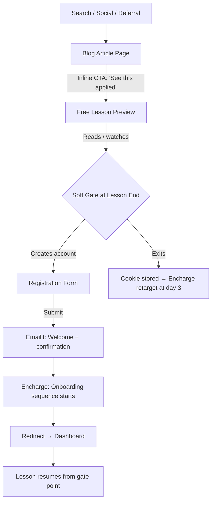
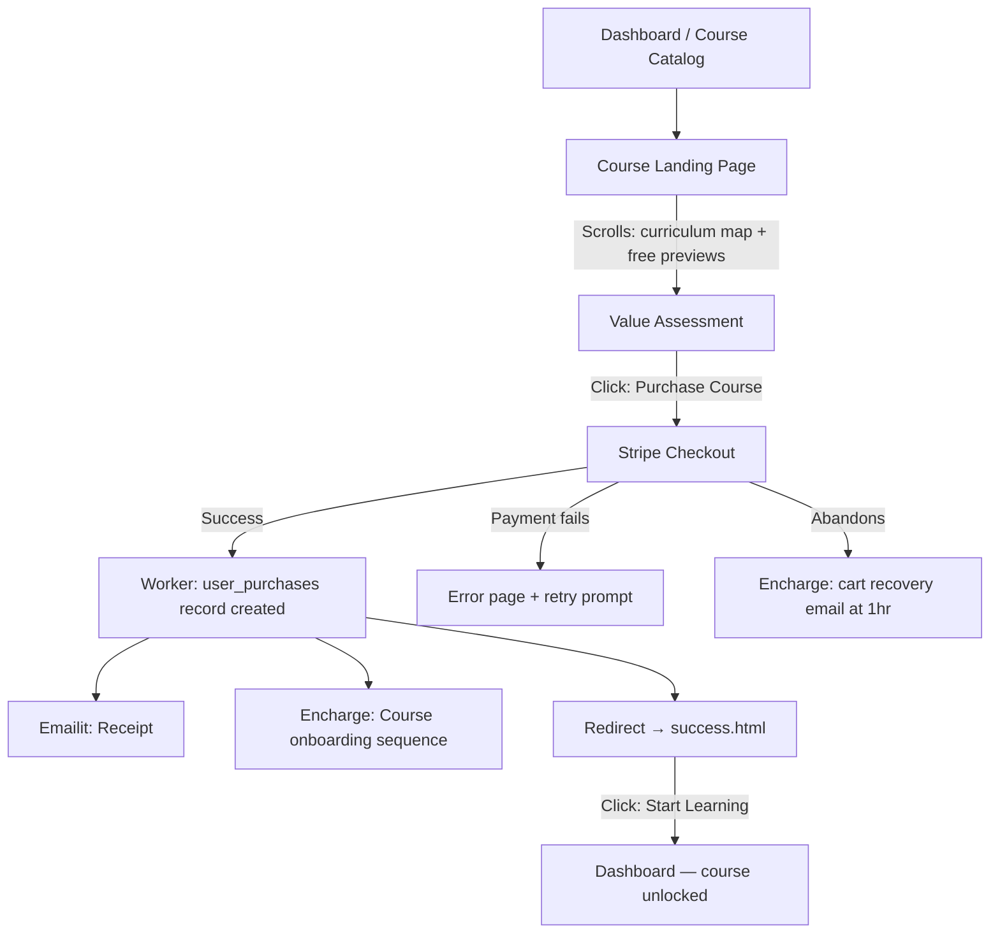
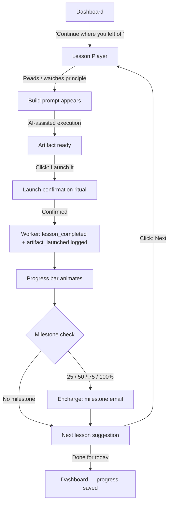
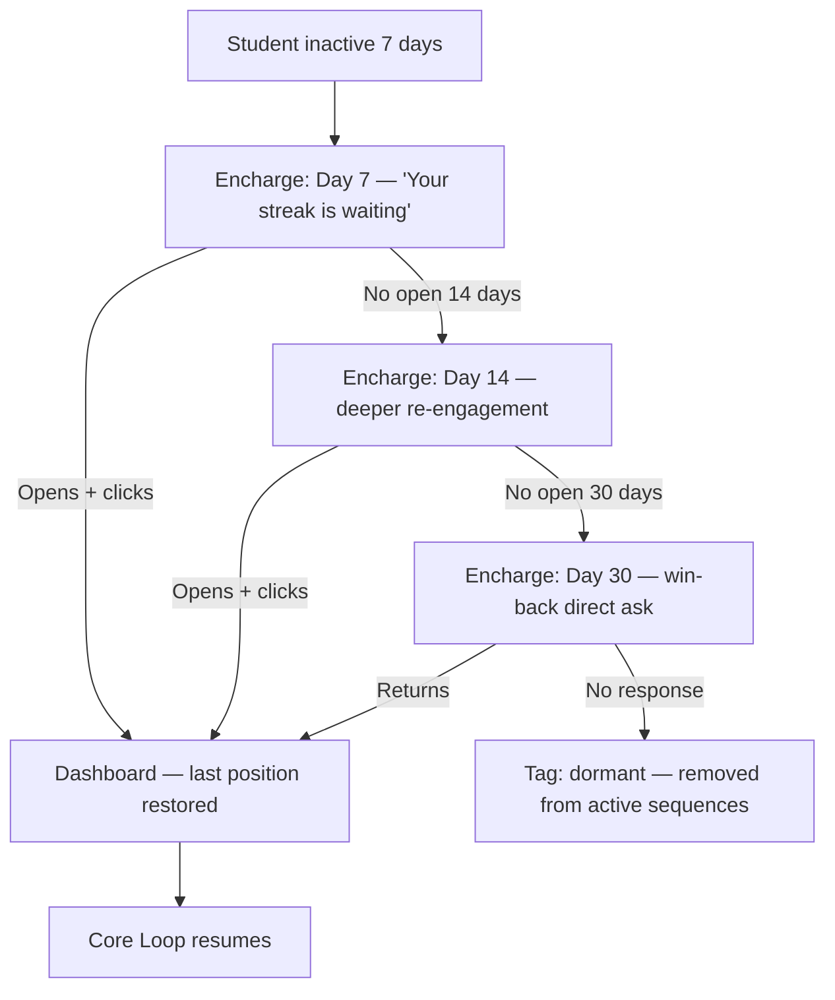

# UX Design Specification — Direct Marketing Mastery School

**Author:** Mister Dest
**Date:** 2026-02-16

---

<!-- UX design content will be appended sequentially through collaborative workflow steps -->

## Executive Summary

### Project Vision

The **Direct Marketing Mastery School** is a self-hosted online education platform that teaches marketing from first principles — not tool tutorials. The platform IS the business: no platform tax, no revenue share, no audience lock-in. Built entirely on Cloudflare (Pages + Workers + D1 + R2), deployed from GitHub.

Brand ethos inherited from F.O.T.F. (Funnels On The Fly): *"Stop building on borrowed ground."* The same freedom the courses teach is embodied in the infrastructure running them. Visual language: neumorphism, Playfair Display + Inter typography, `#e0e5ec` background, `#4b6cb7` accent blue.

The value ladder drives every UX decision: Blog/Free Lessons → Email List → Course Purchase ($399) → Discovery Call → Group Program ($999) → Done-With-You Intensive ($15K).

### Target Users

| Persona | Core Need | UX Priority |
|---------|-----------|-------------|
| **Alex** (Aspiring Entrepreneur) | Quick wins, clear curriculum map | First lesson completable in <10 min; visible learning path |
| **Maria** (Tool Collector) | Principle-first content, credibility signals | Blog trust-building; course descriptions emphasize "why" not "which tool" |
| **James** (The Skeptic) | Lifetime access, platform permanence, clear ROI | Ownership language throughout; no subscription pressure at launch |
| **Priya** (Community Seeker) | Peer connection, shared progress | Dashboard activity feed; community layer in DB now, UI in Phase 2 |

### Key Design Challenges

1. **Trust before purchase** — Zero existing audience, zero social proof at launch. Free previews, clear curriculum maps, lifetime access language, and blog credibility must work together to convert cold traffic.

2. **Progress = retention** — The dashboard must *feel* like momentum. Streak counters, progress bars, "continue learning" CTAs, and milestone emails must fire at the right moments to keep students from going cold.

3. **The value ladder as UX** — The interface must naturally escalate: free → course → consultation. The "Work With Me" CTA must be ever-present but never pushy. On course completion it should feel like the inevitable next step, not a sales interruption.

4. **Admin as daily workflow** — The admin panel is how content gets made, students get managed, and consulting gets tracked. It must be fast, clean, and functional — not an afterthought.

### Design Opportunities

1. **Neumorphic brand continuity** — F.O.T.F. already established a distinctive visual language. Carrying it into the platform creates instant brand recognition and signals craftsmanship — the key trust signal for the skeptical buyer.

2. **The "My Journey" dashboard** — Most course platforms show a list. This shows a *map*: Research → Traffic → Funnels → Email → Advanced. Done right, students feel they're on a path, not buying random content.

3. **Blog as trust machine** — The blog is the top of a fully owned funnel. Clean SEO layout, strong article UX, inline CTAs to free lessons, and email capture embedded naturally into every post.

---

## Core User Experience

### Defining Experience

The ONE core loop: **open lesson → read/watch → mark complete → see progress update.** This is the heartbeat of the platform. Everything else — registration, purchase, dashboard — exists to get users into this loop and keep them in it.

### Platform Strategy

- **Web-first, mobile-responsive** — no native app. Students learn on laptop; discovery happens on mobile.
- **Mouse/keyboard primary** — lesson player, admin, and dashboard optimized for desktop first.
- **No offline** — Cloudflare CDN delivers fast global loads; offline adds complexity with no clear gain.
- **Static-first** — HTML + Alpine.js means near-instant page loads. Shadow depth: lighter on lesson/dashboard pages (visited dozens of times), heavier on marketing pages (course catalog, blog).

### Effortless Interactions

| Interaction | Should Feel Like |
|-------------|-----------------|
| Continuing a course | One click from dashboard to exact position left off |
| Marking a lesson complete | Instant visual feedback → progress bar animates |
| Finding the next free lesson | Immediately obvious on the course page — no hunting |
| Booking a discovery call | Cal.com embed loads inline — no new tab, no friction |
| Buying a course | Stripe → success page → immediate access. Zero steps hidden. |

### Critical Success Moments

1. **First lesson completion** — Progress bar moves and rewards. Student is hooked. If invisible, nothing happened.
2. **Post-purchase redirect** — Course unlocked immediately on `success.html`. Delayed access = panic = churn.
3. **"My Journey" reveal** — First time a student sees their progress mapped across the full curriculum. The moment they realize they're on a *path*, not just watching videos.
4. **Blog-to-register flow** — Read post → click free lesson → soft gate ("create free account to continue") → register. If this breaks, the funnel breaks.
5. **Consultation CTA on completion** — After 100% completion, "Work With Me" feels like the natural next step — not a sales pitch.

### Experience Principles

1. **Speed is respect** — Every page loads fast. Neumorphic design looks premium; slow loads cheapen it. No compromise.
2. **Progress must be visible and rewarding** — If students can't *see* themselves moving forward, they stop. Every completion needs a visual payoff.
3. **Guide, don't push** — The next step in the journey is always clear and compelling. The sales pressure is never felt. CTAs feel like invitations, not interruptions.
4. **Ownership language, everywhere** — "Your courses." "Your progress." "Your data." Constantly reinforce that this platform belongs to the student, not a platform company.
5. **Every screen has one job** — Each page and section has a single primary action. Competing priorities dilute both the UX and the conversion.

---

## Desired Emotional Response

### Primary Emotional Goals

- **Students:** Empowered and progressing. Every lesson completed feels like a brick laid, not a video watched.
- **Prospects (pre-purchase):** Trusted and de-risked. "I can see what I'm getting. I believe this person. I'm safe to buy."
- **Returning students:** Pulled back in — not pushed. A sense of momentum and streak waiting, not guilt.

### Emotional Journey Mapping

| Stage | Target Emotion |
|-------|----------------|
| First visit (blog) | Curious + respected — "This person thinks like me" |
| Free lesson | Surprised by quality — "This is better than I expected" |
| Registration | Confident + safe — "My data is mine, no tricks" |
| First purchase | Excited + reassured — instant access, receipt arrives immediately |
| Lesson completion | Accomplished + momentum — "I'm actually doing this" |
| Dashboard return | Pulled in, not guilty — streak visible, last position saved |
| Course completion | Pride + possibility — "What's next?" surfaces naturally |
| Consultation booking | Ready + valued — not pressured, genuinely interested |

### Micro-Emotions

| Pair | Target | Design Lever |
|------|--------|-------------|
| Confidence vs. Confusion | Confidence | Single primary action per page, clear navigation, no hidden costs |
| Trust vs. Skepticism | Trust | Ownership language, transparent pricing, no dark patterns |
| Accomplishment vs. Frustration | Accomplishment | Instant progress feedback, fast loads, no dead ends |
| Excitement vs. Anxiety | Excited calm | Clean neumorphic UI — premium without being overwhelming |
| Belonging vs. Isolation | Belonging (Phase 2) | Activity feed in dashboard now; community UI deferred |

### Design Implications

| Emotion | UX Choice |
|---------|-----------|
| Empowered & progressing | Progress bars on lesson player, dashboard, and course cards |
| Trusted & de-risked | Lifetime access language on course pages; "your data" copy; no auto-renew pressure |
| Surprised by quality | First free lesson is the best lesson — sets paid course expectations |
| Accomplished + momentum | Lesson completion animation (subtle); streak counter; milestone emails at 25/50/75% |
| Pulled in, not guilty | Dashboard primary CTA: "Continue where you left off" — not a list of everything undone |
| Pride + possibility | Course completion page: completion badge + "Work With Me" shown naturally below |

### Emotional Design Principles

1. **Earn trust before asking for anything** — Every touchpoint before purchase must give before it takes.
2. **Make progress feel inevitable** — Design should make continuing easier than stopping.
3. **Celebrate quietly** — Completions and streaks get acknowledged, never ignored. No confetti cannons — serious platform for ambitious people.
4. **Anxiety is a conversion killer** — Clear pricing, clear outcomes, no surprises — especially at checkout and on the services page.

---

## UX Pattern Analysis & Inspiration

### Inspiring Products Analysis

| Product | What We Steal | Applied To |
|---------|--------------|------------|
| **Duolingo** | Streak mechanic, progress as path not list | Dashboard "My Journey" + streak counter |
| **Readwise** | One-job-per-screen, minimal focused UI | Dashboard layout + lesson player |
| **Stripe Dashboard** | Data-dense but clean admin tables, contextual panels | Admin CRM + student profiles |
| **Gumroad checkout** | Post-purchase clarity, instant access confirmation | `success.html` design |
| **Khan Academy** | Full-viewport lesson player, single CTA | Lesson page layout |
| **Substack reader** | Intimate article experience, personal not corporate | Blog article page |

### Transferable UX Patterns

- **Path-not-list progress** (Duolingo) → "My Journey" curriculum map: Research → Traffic → Funnels → Email → Advanced
- **Streak retention mechanic** → dashboard welcome bar streak counter; synced with Encharge re-engagement at day 3/7/14
- **Full-viewport lesson focus** (Khan Academy) → lesson page: content fills screen, single "Mark Complete" CTA at bottom, no competing elements
- **Post-purchase confirmation clarity** (Gumroad) → `success.html`: confirmation-first, course access visible immediately, receipt email in flight
- **Intimate blog reading** (Substack) → article pages: personal tone, no clutter, byline prominent, inline CTAs to free lessons

### Anti-Patterns to Avoid

| Platform | Anti-Pattern | Why We Avoid It |
|----------|-------------|-----------------|
| Teachable | Over-navigated dashboard | Serves platform complexity, not student goals |
| Kajabi | Feature overload in admin | One owner, one business — stay lean |
| Generic LMS | Progress as percentage only | Percentage without context means nothing — show the path |
| Most course platforms | Course completion = end of relationship | Consultation CTA must appear naturally on completion |

### Design Inspiration Strategy

**Adopt:**
- Duolingo's path-based progress visualization — "My Journey" is the core differentiator
- Khan Academy's full-viewport lesson layout — "every screen has one job"
- Stripe Dashboard's admin table + detail panel pattern — the CRM is a daily workflow tool

**Adapt:**
- Substack's intimate reading experience → apply to blog with the F.O.T.F. brand voice
- Gumroad's minimal checkout success → apply to `success.html` with immediate course access confirmation

**Avoid:**
- Multi-level navigation in admin (Teachable trap)
- Feature flags and settings overload (Kajabi trap)
- Treating course completion as the finish line

---

## Design System Foundation

### Design System Choice

**Custom Neumorphic System — extending F.O.T.F. CSS variables. No external framework.**

Stack constraint (static HTML + Alpine.js) makes React-based systems (MUI, Shadcn, Chakra) incompatible. The F.O.T.F. visual identity is already established and distinctive — we extend it, not replace it.

### CSS Design Tokens

```css
/* Inherited from F.O.T.F. */
--bg-color: #e0e5ec
--text-color: #31344b
--shadow-light: #ffffff
--shadow-dark: #a3b1c6
--accent-color: #4b6cb7
--font-display: "Playfair Display", serif
--font-body: "Inter", sans-serif

/* Semantic additions */
--color-text-secondary: #444b6e
--color-success: #4caf7d
--color-warning: #f5a623
--color-danger: #e05353

/* Shadow scale */
--shadow-sm:  5px 5px 10px var(--shadow-dark), -5px -5px 10px var(--shadow-light)
--shadow-md:  10px 10px 20px var(--shadow-dark), -10px -10px 20px var(--shadow-light)
--shadow-lg:  20px 20px 60px var(--shadow-dark), -20px -20px 60px var(--shadow-light)
--shadow-inset: inset 6px 6px 12px var(--shadow-dark), inset -6px -6px 12px var(--shadow-light)

/* Radius scale */
--radius-sm: 12px   --radius-md: 20px
--radius-lg: 40px   --radius-pill: 50px

/* Spacing (8pt grid) */
--space-1: 8px   --space-2: 16px   --space-3: 24px
--space-4: 32px  --space-6: 48px   --space-8: 64px
```

### Shadow Weight by Page Type

| Page Type | Shadow Weight | Rationale |
|-----------|--------------|-----------|
| Marketing (home, catalog, blog) | `--shadow-lg` | Full brand presence, first impressions |
| Dashboard, lesson player | `--shadow-md` | Functional, visited repeatedly — lighter |
| Admin panels | `--shadow-sm` | Data-dense, minimal visual distraction |

### Core Components to Define

- **Card** — neumorphic container, `--shadow-md`, `--radius-lg`, hover lifts
- **Button** — primary/secondary, pill shape (`--radius-pill`), inset on `:active`
- **Input** — inset shadow (`--shadow-inset`), focus state reduces depth
- **Progress bar** — accent fill over inset track
- **Badge** — completion, streak, lock state variants
- **Navigation** — sidebar for admin, top bar for public pages

---

## Defining Core Experience

### 2.1 Defining Experience

> **"Apply what you just learned, use the tools, and launch a working funnel before you close your laptop."**

This platform's defining interaction is the **Learn → Build → Launch loop** — a tight cycle where every lesson deposits a real, launchable artifact into the student's hands. Not theory. Not notes. A live funnel, email sequence, or landing page — built with AI assistance — ready to test today.

The dinner-party sentence: *"Something that used to take me three months, I can build in a few hours now."*

The magic is speed earned through mastery — not shortcuts. Students who understand the principles move fast. The platform's job is to install that process until execution becomes instinctual.

### 2.2 User Mental Model

Students arrive believing marketing systems require months of planning, expensive tools, and technical expertise. They've been burned by complexity — buying tools before they understood the principles, building funnels before they understood the traffic.

What they actually need is a *process they trust enough to execute quickly.*

The platform's job is to install that process. Once a student trusts the framework, speed is the natural result.

| Mental Model Shift | Before | After |
|-------------------|--------|-------|
| Timeline | "This takes 3 months to build" | "I can build this in a session" |
| Complexity | "I need a tech team for this" | "I know what to connect, and AI builds it" |
| Risk | "What if I get it wrong?" | "Launch, test, iterate — nothing is permanent" |
| Learning | "I watch courses, then figure it out" | "I learn, then build the real thing — in the same session" |

**What they love about existing solutions:** The occasional "aha" moment when something clicks.
**What they hate:** Finishing a course and still not knowing what to actually *do* next.
**The shortcut they currently use:** Buying done-for-you templates — which work until they don't, because they don't understand *why*.

### 2.3 Success Criteria

- Student launches their first real funnel within the first week of purchase
- Time-to-first-test drops from months → days → hours as mastery builds
- The "Launch, Test" loop becomes habitual — not scary
- Students can explain *why* their funnel works, not just *that* it works
- Completion of a module feels like a **deliverable delivered**, not a checkbox ticked
- Students describe the platform to others using speed and execution language, not content language

### 2.4 Novel vs. Established Patterns

**This is novel for an education platform.**

Most courses separate learning from execution — you watch, then you go figure it out later, alone. This platform embeds execution INTO the curriculum. The lesson isn't done until the artifact is built.

The AI assistance (MCPs, prompt templates, copy frameworks) isn't a shortcut — it's the *subject matter*. Students learn to wield AI correctly because the platform teaches it inside the lesson context. The skill being taught IS the speed.

**Familiar metaphor we can use:** Cooking class, not cookbook. You don't just read the recipe. You make the dish. The lesson ends when the plate is ready.

**Education for novelty:** The "build inside the lesson" pattern needs a brief orientation moment — a first-lesson design element that signals: *"By the end of this, you will have made something real."* Once the pattern is understood, students will seek it.

### 2.5 Experience Mechanics

**Initiation:**
Every lesson opens with an outcome statement: *"By the end of this, you'll have [specific artifact] ready to launch."* No ambiguity about where the session is going. The student knows what they're building before they start.

**Interaction:**
- Principle taught (why this works)
- Guided build session (how to apply it)
- AI-assisted execution (MCPs, prompt templates, copy frameworks built into the lesson)
- Student applies it to their own business context — not a fake exercise

**Feedback:**
Real artifact completion state. The lesson doesn't end with "quiz passed" — it ends with "this is ready to launch." Progress indicators measure *builds shipped* and *tests run*, not videos watched.

**Completion — The Launch Moment:**
A deliberate ritual marks the end of each lesson: a "Launch It" prompt, a checklist confirmation, a button that makes it real. This isn't cosmetic — it's behavioral. The action of committing to launch is part of the learning. Course completion is secondary. **The launch is the milestone.**

**The Loop:**
```
Learn principle → Build artifact → Launch → Test → Return with data → Next lesson
```

This loop is the platform's entire purpose. The UI, the dashboard, the emails — everything serves this loop.

---

## Visual Design Foundation

### Color System

**Light Mode (extends F.O.T.F. tokens):**

| Token | Value | Purpose |
|-------|-------|---------|
| `--bg-color` | `#e0e5ec` | Page background |
| `--text-primary` | `#31344b` | Body text, headings |
| `--text-secondary` | `#444b6e` | Subtext, labels, metadata |
| `--accent-primary` | `#4b6cb7` | Authority blue — CTAs, links, active states |
| `--accent-secondary` | `#f0a030` | Momentum gold — highlights, badges, launch moments |
| `--color-success` | `#4caf7d` | Completions, progress, positive feedback |
| `--color-warning` | `#f5a623` | Caution states |
| `--color-danger` | `#e05353` | Errors, destructive actions |
| `--shadow-light` | `#ffffff` | Neumorphic raised edge |
| `--shadow-dark` | `#a3b1c6` | Neumorphic recessed edge |

**Secondary accent rationale:** `#f0a030` — a warm momentum gold. Blue = calm authority, knowledge, trust. Gold = energy, speed, the launch moment. When a student hits "Launch It," that button glows gold. Streak milestones: gold. Everything that says *move* is gold. Everything that says *study* is blue.

**Dark Mode token layer:**

```css
/* Dark Mode overrides — toggle via [data-theme="dark"] on <html> */
--bg-color:         #1a1f2e;   /* deep navy-slate */
--text-primary:     #e8ecf4;   /* soft white */
--text-secondary:   #9aa3c2;   /* muted blue-gray */
--shadow-light:     #252b3d;   /* lifted edge in dark */
--shadow-dark:      #0e1218;   /* recessed edge in dark */
--accent-primary:   #6b8cd4;   /* lightened blue — readable on dark */
--accent-secondary: #f5b44a;   /* warmer gold — pops harder on dark */
```

Dark mode preserves neumorphism using the same shadow technique — inverted palette. Raised elements catch `#252b3d` light, recessed elements sink to `#0e1218`. Premium carved surface, not flat dark.

### Typography System

**Typefaces:**
- `Playfair Display` — display, headings, hero text. Signals expertise, premium quality, permanence.
- `Inter` — body, UI labels, data, all functional text.

**Fluid Type Scale:**

| Role | Font | Size | Usage |
|------|------|------|-------|
| Hero / H1 | Playfair Display | `clamp(32px, 5vw, 56px)` | Landing hero, course titles |
| H2 | Playfair Display | `clamp(24px, 3.5vw, 40px)` | Section headings |
| H3 | Playfair Display | `clamp(20px, 2.5vw, 28px)` | Card titles, module names |
| H4 and below | Inter | `clamp(16px, 1.8vw, 20px)` | Sub-headers — Inter at small sizes |
| Body | Inter | `16–18px` | Lesson content, blog posts |
| UI Labels | Inter | `14px` | Buttons, navigation, badges |
| Micro | Inter | `12px` | Timestamps, footnotes |
| Line height | — | `1.6 (body) / 1.2 (headings)` | Comfortable reading, tight display |

**Mobile rule:** Playfair Display caps at H3. Below that, and at viewport widths under 480px, Inter takes over. Playfair serifs at small sizes on low-DPI screens degrade — Inter stays crisp at any size.

### Spacing & Layout Foundation

**Base unit:** 8px

| Token | Value | Usage |
|-------|-------|-------|
| `--space-1` | `8px` | Tight internal padding |
| `--space-2` | `16px` | Card inner padding, small gaps |
| `--space-3` | `24px` | Section element separation |
| `--space-4` | `32px` | Card-to-card gaps |
| `--space-6` | `48px` | Section top/bottom padding |
| `--space-8` | `64px` | Major section breaks |

**Density by page type:**
- Marketing pages (home, catalog, blog): breathe — `--space-6` to `--space-8` between sections
- Dashboard & lesson player: functional — `--space-3` to `--space-4`
- Admin panels: data-dense — `--space-2` throughout

**Grid:** 12-column desktop, 4-column tablet, 1-column mobile. Content column max-width `1200px`, centered.

### Accessibility Considerations

| Check | Result | Note |
|-------|--------|------|
| Blue `#4b6cb7` on bg `#e0e5ec` | ✅ ~4.8:1 | Passes WCAG AA |
| Gold `#f0a030` on bg `#e0e5ec` | ✅ ~3.4:1 | Passes for large text/UI — avoid on small body text |
| Dark text `#e8ecf4` on `#1a1f2e` | ✅ ~12:1 | Exceeds AAA |
| Minimum touch target | `44×44px` | All interactive elements |
| Focus states | Visible ring | `outline: 2px solid var(--accent-primary)` on all focusable elements |

---

## Design Direction Decision

### Design Directions Explored

Six directions were explored, each representing a distinct visual philosophy:

| # | Direction | Core Idea |
|---|-----------|-----------|
| 1 | The Journey | Curriculum as a path map — progress visualization dominates |
| 2 | The Launchpad | Action-first, gold CTAs, the build/launch loop always visible |
| 3 | The Academy | Full-viewport lesson player, minimal chrome, single CTA |
| 4 | The Architect | Stripe-inspired data tables, metrics-first structure |
| 5 | Midnight Command | Dark neumorphism — navy-slate with gold accents |
| 6 | The Editorial | Blog-first trust-building, Substack-intimate reading experience |

Reference file: `planning-artifacts/ux-design-directions.html`

### Chosen Direction

**Hybrid — context-specific directions by page type, dark mode as default.**

| Context | Direction | Applied From |
|---------|-----------|-------------|
| Dashboard | The Journey | Direction 1 — path map as primary navigation |
| CTAs & progress | Launchpad elements | Direction 2 — gold "Launch It" + visible loop |
| Lesson player | The Academy | Direction 3 — full-viewport, zero chrome |
| Blog & marketing | The Editorial | Direction 6 — Playfair authority, inline CTAs |
| All screens | Midnight palette | Direction 5 — dark mode default |

### Design Rationale

The platform spans four fundamentally different user contexts — each demanding a different visual priority. A single direction applied uniformly would force compromises that weaken the experience in at least two of those contexts.

The hybrid approach is intentional:

- **The Journey dashboard** makes the "My Journey" path map the hero — directly embodying the platform's core differentiator. Students see their position in the curriculum before anything else.
- **Launchpad gold CTAs** are layered into every context as action markers. The gold "Launch It" button and the visible Learn→Build→Launch loop keep the defining experience in focus, not just the content.
- **The Academy lesson player** removes everything that competes with content. When a student is in a lesson, the UI disappears — only the material and a single "Mark Complete" CTA remain.
- **The Editorial blog** earns trust before any purchase decision. Cold traffic needs authority, intimacy, and a frictionless path from article to free lesson.
- **Dark mode as default** is a deliberate brand signal. Every other course platform is light. This one feels like a command center.

### Implementation Approach

- CSS variable layer handles dark/light mode switching globally — `[data-theme="dark"]` on `<html>`
- Page-type classes (`page--dashboard`, `page--lesson`, `page--blog`, `page--marketing`) control which direction's layout rules apply
- Gold accent (`--accent-secondary`) is used exclusively for action moments — "Launch It," streak milestones, and completion celebrations
- Blue accent (`--accent-primary`) governs navigation, links, active states, and informational elements
- The "My Journey" path component is the first above-the-fold element on every authenticated page

---

## User Journey Flows

### Journey 1: Cold Traffic → Registration

The blog is the top of a fully owned funnel. This journey must be frictionless — the gate earns its ask by delivering value first.



**Key decisions:** Gate fires after the lesson delivers value. Registration ask is earned, not forced. No login wall on the blog ever.

---

### Journey 2: Registration → First Course Purchase

The curriculum map and free previews must do the selling before the checkout screen appears.



**Key decisions:** `success.html` shows course access before the receipt. Confidence first, confirmation second.

---

### Journey 3: The Core Loop — Learn → Build → Launch

The heartbeat of the platform. Every lesson ends with a real, launchable artifact — not a checkmark.



**Key decisions:** "Launch It" is a deliberate ritual. Progress animates visually before email fires — instant feedback, never waiting.

---

### Journey 4: Course Completion → Consultation Booking

The value ladder escalation must feel like a natural next step, not a sales pitch interrupting a celebration.

```mermaid
flowchart TD
    A[Final lesson completed] --> B[Worker: 100% completion logged]
    B --> C[Encharge: Completion email]
    B --> D[Completion page renders]
    D -->|Completion badge shown| E[Work With Me CTA — below fold]
    E -->|Click: Book a Call| F[/services page]
    F -->|Cal.com embed loads| G[Calendar view]
    G -->|Books call| H[Worker: /api/webhooks/cal]
    H --> I[D1: consultation logged]
    H --> J[Emailit: Booking confirmation]
    H --> K[Encharge: Pre-call nurture sequence]
    G -->|Exits without booking| L[Encharge: follow-up at day 3]
```

**Key decisions:** Badge appears above the CTA — celebration always comes first. Work With Me is below the fold, never instead of the completion moment.

---

### Journey 5: Re-engagement — Inactive Student

Students don't churn in a day. The email sequence buys three chances to bring them back.



**Key decisions:** Day 7 subject line references the streak by name. Personalization hooks emotional investment, not generic urgency.

---

### Journey Patterns

**Navigation:**
- Single primary CTA per screen — nothing competes with the main action
- Last position always saved, always restored — no student ever starts from zero
- Path map always visible on dashboard — spatial orientation at every return visit

**Decision:**
- Soft gates not hard walls — content delivers value before registration is requested
- Confirmation ritual before irreversible moments (purchase, launch)
- Clear escape routes at every branch — no dead ends, no dark patterns

**Feedback:**
- Visual feedback fires before email confirmation — never make the user wait for proof
- Progress animations trigger on completion — static progress bars feel broken
- Milestone emails are celebratory, not promotional — the achievement is the message

### Flow Optimization Principles

1. **Steps to value, minimized** — Registration is the only required step before the first lesson. Purchase is the only step before course access. No profile completion wizard, no onboarding blocker.
2. **Every exit has a return path** — Abandoned checkout: email at 1hr. Exited soft gate: retargeted at day 3. Inactive student: 3-stage re-engagement at 7/14/30 days. Nobody falls through.
3. **Artifacts over checkmarks** — The Launch moment is a designed ritual. The act of committing to launch is part of the learning, not an automated state change.
4. **Escalation never interrupts celebration** — Work With Me CTA appears below the completion badge, never instead of it.

---

## Component Strategy

### Design System Components

The base design system provides CSS tokens only (color, shadow, spacing, typography, radius). No pre-built components exist — every UI element is custom-built on top of those tokens.

| Token Layer | Status |
|-------------|--------|
| Color palette (light + dark mode) | ✅ Defined |
| Shadow scale (sm/md/lg/inset) | ✅ Defined |
| Typography scale (fluid, Playfair + Inter) | ✅ Defined |
| Spacing grid (8pt) | ✅ Defined |
| Border radius scale | ✅ Defined |
| UI Components | 🔨 All custom-built |

### Custom Components

#### Foundation Components

**Card** — Primary neumorphic container for grouped content.
- States: raised (default), hover (lifts), selected (inset), disabled (flat, 40% opacity)
- Variants: `sm` (12px radius, shadow-sm), `md` (20px radius, shadow-md), `lg` (40px radius, shadow-lg)
- Accessibility: `role="region"` with `aria-label` when used as section container

**Button** — Primary interaction trigger.
- States: raised (default), hover (lifts), active/pressed (inset — physically depresses), disabled (flat), loading (spinner)
- Variants: `primary` (blue), `secondary` (raised, no fill), `launch` (gold — reserved exclusively for Launch It), `ghost` (text only)
- Rule: Gold variant used only for the Launch It action — nowhere else

**Input** — Text entry for forms.
- States: default (inset shadow), focus (deeper inset + blue outline ring), error (red ring + message below), disabled (flat)
- Variants: `text`, `email`, `password` (show/hide toggle), `textarea`
- Accessibility: Visible `<label>` required, `aria-describedby` for error messages

**Progress Bar** — Visual progress for lessons, modules, course completion.
- States: empty (inset track), partial (blue fill, animates on update), complete (green)
- Variants: `thin` (4px, card subtitles), `medium` (8px, lesson player), `thick` (12px, dashboard)
- Behavior: Fill always transitions `ease-out 0.4s` — never jumps

**Badge** — State indicator for lessons and achievements.
- Variants: `locked` (gray, lock icon), `available` (blue), `in-progress` (blue pulse), `complete` (green, check), `streak` (gold, flame)

#### Core Platform Components

**Journey Path Map** *(flagship — unique differentiator)*
- Purpose: Visualizes the full curriculum as a path with nodes: Research → Traffic → Funnels → Email → Advanced
- States: `complete` (green fill), `active` (blue pulse), `locked` (gray, lock icon), `available` (blue outline)
- Behavior: Clicking a node opens module detail. Active node always centered on mobile.
- Accessibility: `role="navigation"`, each node is keyboard-navigable, `aria-current="step"` on active
- Placement: First above-the-fold element on every authenticated dashboard page

**Lesson Player**
- Purpose: Full-viewport content container — zero chrome, single CTA (Academy direction)
- Anatomy: Sticky top bar (module + back), scrollable content, sticky bottom bar ("Mark Complete" + progress)
- States: `reading`, `completing` (loading), `complete` (CTA becomes "Next Lesson →")
- Behavior: Scroll position saved on exit. Mark Complete fires Worker → animates progress → redirect.

**Launch Ritual**
- Purpose: The ceremonial completion moment — a deliberate confirmation sequence, not just a button
- Anatomy: Gold "Launch It" button → confirmation modal → confirm → celebration flash → progress update
- States: `idle`, `confirming` (modal), `launching` (spinner), `complete` (celebration)
- Behavior: Confirmation step is intentional and cannot be skipped. The act of confirming is part of learning.

**Course Card**
- Purpose: Displays a course in the catalog and dashboard
- States: `locked` (preview CTA, lock badge), `enrolled` (progress bar + Continue), `complete` (green badge)
- Variants: `catalog` (full with description), `dashboard` (compact, progress-focused)

**Soft Gate Overlay**
- Purpose: Registration prompt at lesson end — earns the ask by delivering value first
- Behavior: Does not block lesson playback until end. Lesson replayable without re-trigger for the session. On registration, overlay removes and lesson continues.

**Streak Counter**
- States: `active` (gold), `at-risk` (orange, warning message), `broken` (gray, restart prompt)
- Behavior: Breaks at midnight if no lesson completed. Encharge re-engagement fires at day 3 inactivity.

**Milestone Toast**
- Purpose: Non-intrusive celebration at 25/50/75/100% completion
- Behavior: Slides in bottom-right, 4s display, never blocks content. 100% toast links to completion page.

#### Admin Components

**Data Table**
- Purpose: Student, course, and consultation management — the daily operator workflow
- States: `loading` (skeleton rows), `populated`, `empty` (with action prompt), `row-selected` (highlight)
- Variants: `students`, `courses`, `consultations`
- Design: `shadow-sm` only — data-dense, minimal visual distraction

**Student Profile Panel**
- Purpose: Detail view for a selected student, slides in from the right
- Anatomy: Name, email, registration date, course progress bars, activity log, Encharge tags, notes
- Behavior: Dismisses on Escape key or outside click. Table remains visible behind panel.

### Component Implementation Roadmap

**Phase 1 — Core (required for every user journey)**

| Component | Critical For |
|-----------|-------------|
| Card | Foundation for all UI |
| Button (all variants) | Every CTA in every journey |
| Input | Registration, login, admin |
| Progress Bar | Lesson player, dashboard |
| Badge | Course catalog, lesson states |
| Navigation (top bar + sidebar) | Global chrome |
| Journey Path Map | Dashboard flagship |
| Lesson Player | Core loop |
| Soft Gate Overlay | Cold traffic → registration |

**Phase 2 — Supporting (full experience)**

| Component | Critical For |
|-----------|-------------|
| Course Card | Catalog + dashboard |
| Launch Ritual | Core loop completion |
| Streak Counter | Retention + re-engagement |
| Milestone Toast | Completion milestones |
| Data Table | Admin daily workflow |

**Phase 3 — Enhancement**

| Component | Critical For |
|-----------|-------------|
| Student Profile Panel | Admin CRM |
| Blog Article Card | Editorial blog index |
| Completion Page | Value ladder escalation |

---

## UX Consistency Patterns

### Button Hierarchy

One primary action per screen — maximum. No exceptions.

| Variant | Color | When to Use |
|---------|-------|-------------|
| `primary` | Blue (`--accent-primary`) | Main CTA: Continue, Purchase, Submit, Register |
| `launch` | Gold (`--accent-secondary`) | Launch It — this action only, nowhere else |
| `secondary` | Raised, no fill | Alternative or back actions |
| `ghost` | Text only | Low-priority or destructive actions |

**Rules:**
- Gold outranks blue when both appear on screen — the launch button always wins visual weight
- Destructive actions always appear left of confirming actions
- Button labels describe outcomes, never actions: "Start Learning" not "Click here"

### Feedback Patterns

**Success:** Milestone Toast (bottom-right, 4s auto-dismiss) for small wins. Dedicated success page (`success.html`) for purchase confirmation — never a toast for that.

**Error:** Inline below the field (form errors, on blur). Red banner above the form for system/API errors. Always show what to do next — never block without an escape.

**Warning:** Orange badge (streak at risk), orange banner (payment issues). Color `--color-warning`.

**Info:** Hover tooltips for clarifying labels only. No info modals — if it needs a modal it's a feature.

**Loading:**
- Page-level: Skeleton screens (content-shaped blocks) — never a spinner alone
- Action-level: Spinner replaces button label, button width locked to prevent layout shift
- Page transitions: Thin blue progress bar at top of viewport (2px, no radius)

### Form Patterns

- Validation fires on blur — never on keystroke
- Required fields marked with `*`, explained at form top
- Submit button disabled until all required fields valid
- Error anatomy: Red ring on field + red 12px message directly below
- Single-step forms only in MVP

### Navigation Patterns

**Public:** Top nav — Logo · Blog · Courses · Services · Sign In. Mobile: hamburger → full-screen overlay.

**Authenticated (student):** Top nav + Journey Path Map as primary nav on dashboard. Path map IS the navigation — no persistent sidebar for students.

**Admin:** Left sidebar — Students · Courses · Consultations · Settings. Collapses to icon rail on tablet. Active item: inset neumorphic (depressed), not just colored. Mobile: bottom tab bar (4 icons).

### Modal and Overlay Patterns

**Use only for:** Launch Ritual confirmation, Soft Gate overlay, destructive confirmations (admin only).

**Never use for:** Info display, success confirmations, onboarding flows.

**Behavior:** Dismissible via Escape + backdrop click (except Launch Ritual — must choose). Focus trapped. Backdrop: `rgba(26,31,46,0.6)` + `blur(4px)`. Animation: scale 95→100% + fade, 150ms ease-out.

### Empty States

Every empty state: context + visual signal + clear CTA.

| Screen | Message | CTA |
|--------|---------|-----|
| Dashboard — no courses | "Your journey starts here" | Browse Courses |
| Admin — no students | "Share your course link to get started." | Copy link |
| Admin — no consultations | "No consultations booked yet." | Share services page |

Visual: Inset neumorphic container, line-art icon, message, CTA button.

### Loading States

Skeleton screens for all content areas — gray shaped blocks matching content dimensions. Never full-page spinners.

### Search and Filtering (Admin Only)

- Debounced input (300ms), no submit button needed
- Results count always visible and live-updating
- Active filters shown as removable pill chips
- Sort by column header click: ascending → descending → default, arrow icon indicates state
- Empty search result: "No results for '[query]'" + clear search link

---

## Responsive Design & Accessibility

### Responsive Strategy

Students learn on laptop. Discovery happens on mobile. Admin is desktop-only.

| Context | Primary Device | Priority |
|---------|---------------|----------|
| Blog / marketing | Mobile + Desktop | Mobile-first reading |
| Dashboard + lessons | Desktop | Desktop-first, mobile-responsive |
| Admin panel | Desktop only | No mobile optimization needed |

No native app. No offline. Static HTML + Alpine.js — responsive in CSS, interactive in JS.

### Breakpoint Strategy

```css
/* Default (mobile): < 768px */
@media (min-width: 768px)  { /* Tablet    */ }
@media (min-width: 1024px) { /* Desktop   */ }
@media (min-width: 1280px) { /* Wide — content max: 1200px */ }
```

| Component | Mobile (<768px) | Tablet (768–1023px) | Desktop (1024px+) |
|-----------|----------------|---------------------|-------------------|
| Journey Path Map | Horizontal scroll, active centered | All 5 nodes visible | Full width with labels |
| Course catalog | 1 column | 2 columns | 3 columns |
| Lesson player | Full screen, minimal chrome | Full width max 800px | Max 800px centered |
| Top navigation | Hamburger → overlay | Hamburger → overlay | Full horizontal nav |
| Admin sidebar | Bottom tab bar (4 icons) | Icon rail (collapsed) | Full sidebar with labels |

### Accessibility Strategy

**Target: WCAG 2.1 Level AA**

- Color contrast: All verified in Step 8 — blue/bg ~4.8:1 ✅, dark mode text ~12:1 ✅
- Touch targets: 44×44px minimum all interactive elements
- Focus: Visible ring always — `outline: 2px solid var(--accent-primary)` — never `outline: none`
- Skip link: "Skip to main content" at top of every page (visible on focus)
- Semantic HTML: `<nav>`, `<main>`, `<article>`, `<section>`, `<button>`, `<a>` throughout
- Screen reader: `aria-live="polite"` on progress updates and toasts; `aria-current="step"` on active path node; `aria-label` on icon-only buttons
- Motion: `@media (prefers-reduced-motion: reduce)` disables all transitions and animations

### Testing Strategy

| Browser | Platform | Priority |
|---------|----------|----------|
| Safari | macOS + iOS | P1 — primary student browser |
| Chrome | macOS + Android | P1 |
| Firefox | macOS + Windows | P2 |

**Accessibility:** VoiceOver (macOS/iOS), keyboard-only navigation of all 5 user journeys, Lighthouse a11y score ≥ 90.

### Implementation Guidelines

- Mobile-first CSS media queries, desktop-first design thinking
- Fluid type via `clamp()` — no breakpoint changes for typography
- CSS Grid for page layout, Flexbox for component internals — no CSS framework
- Neumorphic shadows use CSS vars — dark mode is purely a variable swap on `<html data-theme="dark">`
- Alpine.js for: menu toggle, modal open/close, form validation, dark mode toggle
- Developer checklist per component: tested at 320/768/1024/1280px, keyboard navigable, focus visible, screen reader tested, reduced-motion respected, 44px touch targets
